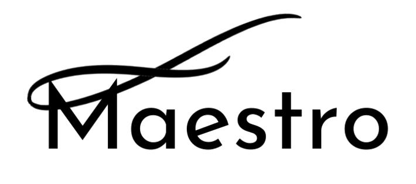

# BMW-2: Maestro

Maestro is redesigning the driving experience for users of autonomous cars by combining micro-gestures and gaze tracking to transform what you can accomplish on your daily commute.
 <!-- so you can focus on the task that matters most: driving. -->
<!-- We aim to enable fast, intuitive, and effortless monitoring of car surroundings during Level 4 and Level 5 autonomy. We will use the windshield as a display to render the car and its full surroundings from a third-person view, with the viewpoint responsive to the position and orientation of the driver’s head. The view of the surroundings will be produced by real-time 3-D reconstruction from data from camera and range sensors on the car. By revolutionizing the way drivers interact with their cars, our product will increase their sense of safety on the road and their trust in autonomous driving systems. -->

# Team Members
Member | Photograph | Email
--- | --- | ---
Alex Wang |  | jwang98@stanford.edu
Tyler Yep |  | tyep@stanford.edu
Ellen Roper|  | eroper@stanford.edu
Eric Singh |  | esingh10@stanford.edu
Grant Russell |  | grantrus@stanford.edu

# Team Skills Matrix

Member | Technical Skills | Non-Technical Skills | Personal Traits | Desired Growth | Weaknesses | Hat
--- | --- | --- | --- | --- | --- | ---
Alex | Machine Learning, Backend | Software development experience, Teamwork | Team-oriented, opinionated but open to all ideas, critical when evaluating ideas, execute + implement prototypes quickly | Be more creative, coming up with + implementing ideas the whole way, Product design | Can be stubborn, Limited creativity in areas that I lack experience in | Black Hat
Tyler | AI/ML, Computer Vision, Python, UnityVR, Web Dev, React | Creativity, Team management, Process evaluation | Chill, Helpful, Detailed, Optimistic cynicism | Software Release & Deployment | Gets caught up in unimportant details | Green Hat
Ellen | C++, C, Python, ARKit, Web Dev | Team/Product Management, Rapid prototyping, Design Thinking/UX/UI design, Good aesthetic sense | Hard-working, Organized, Fast learner, Presentation/public speaking | Programming, Confidence | Programming | Blue Hat
Eric | iOS, basic AI, Python, C++ | Public Speaking, Management, Idea Execution, Design Thinking, Rapid prototyping | Optimistic, Caring, Supportive | Product Management, Scalable Code Development | Stubborn, Limited Software Development | Yellow Hat
Grant | Computer Vision, NLP, VR/AR Dev, Robotics | Team spirit, Ideation | Cool, radical, contradictory | User Interviews, Business Development | Organization | Green Hat

# Team Communication
1. Email us at [drivemaestrai@gmail.com](drivemaestrai@gmail.com).

2. Find our group chat on FB Messenger!

3. [Google Drive](https://drive.google.com/drive/folders/1cV6B6hpXUVpouP2769PhZ1-WBeDPmWPm?usp=sharing) for documents.

<!-- 3. Slack: [hella210.slack.com](https://hella210.slack.com) (sign up [here](http://hella210.slack.com/signup)). -->

<!-- 4. [Google Calendar](https://calendar.google.com/calendar/embed?src=2g53vl4sf7n5rd4ete19r4vivo%40group.calendar.google.com&ctz=America/Los_Angeles) for schedule coordination. -->

<!-- 5. [Asana](https://app.asana.com/0/287787368549392/calendar) for task management. -->

<!-- 6. [Instagram](https://www.instagram.com/drivebychariot/) for fun. -->
